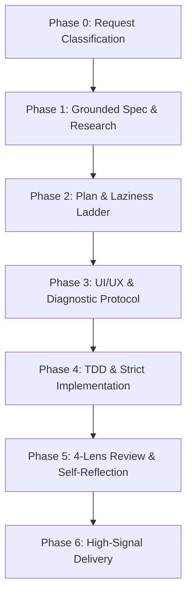

# Unified Engineering Protocol (12-in-1 Master Stack)

This skill fuses all 12 engineering, design, and reasoning frameworks into a single seamless, automated development lifecycle. Every task automatically passes through these integrated phases.

---

## 🧭 The 6 Unified Execution Phases

### Phase 0: Router & Task Classification
The agent automatically identifies the task archetype:
1. **Bug Fix / Regression** $\rightarrow$ Routes to 5-Step Diagnosis + Surgical Fix.
2. **New Feature / Screen** $\rightarrow$ Routes to Grounded Spec + TDD + Design System.
3. **UI / Polish** $\rightarrow$ Routes to `DESIGN.md` Tokens + Taste Anti-Slop + WCAG AA.
4. **Refactoring** $\rightarrow$ Routes to Safe Refactoring Protocol + Compiler Verification.
5. **Technical Investigation** $\rightarrow$ Routes to Grounded Research (Expo 56 / React 19).

---

### Phase 1: Grounded Spec & Research (`Karpathy` + `Superpowers` + `Last30Days`)
- **Think Before Coding**: Never guess ambiguous requirements. State explicit assumptions.
- **Grounded Verification**: Tra cứu tài liệu chuẩn Expo SDK 56 (`https://docs.expo.dev/versions/v56.0.0/`) & React 19; tuyệt đối không dùng API lỗi thời hoặc hallucinate.
- **Domain Clarification**: Xác nhận rõ ràng luồng dữ liệu (Redux slices, props, storage) trước khi viết code.

---

### Phase 2: Plan & The Laziness Ladder (`Ponytail` + `Superpowers` + `GStack`)
- **The Laziness Ladder**:
  1. *Don't write code* (sử dụng component/logic có sẵn).
  2. *Standard & Native Library* (React Native / Expo core APIs).
  3. *Lightweight local helper* (< 30 dòng TS).
  4. *Add dependency* (chỉ khi bắt buộc và đã kiểm tra bundle size).
- **YAGNI**: Không over-engineering, không tạo abstraction thừa cho tương lai giả định.
- **Bite-sized plan**: Chia nhỏ công việc thành các bước 2–10 phút với tiêu chí kiểm tra rõ ràng.

---

### Phase 3: Design Craftsmanship & Diagnostics (`UI/UX Pro Max` + `Taste` + `Matt Pocock`)
- **Nếu là Bug Fix**:
  1. *Reproduce*: Tạo test case tái hiện lỗi.
  2. *Minimize*: Thu nhỏ phạm vi tối đa.
  3. *Hypothesize*: Đặt giả thuyết kỹ thuật.
  4. *Instrument*: Log / assert đo đạc.
  5. *Verify*: Sửa lỗi chính xác tại gốc rễ.
- **Nếu là Giao diện (UI/UX)**:
  - **Zero Hardcoded Colors**: Bắt buộc dùng token từ [`DESIGN.md`](file:///d:/Kindr/DESIGN.md).
  - **Anti-Slop Craftsmanship**: Viền mờ 1px tinh tế, typography nhịp điệu, không dùng emoji làm icon, chỉ dùng Lucide SVG.
  - **Touch Ergonomics**: Nút bấm $\ge$ 44x44pt, hỗ trợ Safe Area & Keyboard Avoiding.
  - **WCAG AA**: Đảm bảo độ tương phản chuẩn trên cả Light & Dark theme.

---

### Phase 4: TDD & Strict Implementation (`Superpowers` + `Matt Pocock` + `Karpathy`)
- **Strict TDD**: Viết test trước (Red) $\rightarrow$ Viết code tối thiểu để pass (Green) $\rightarrow$ Tối ưu hóa (Refactor).
- **Strict TypeScript**: Không dùng `any`, dùng Discriminated Unions cho Async state, khai báo kiểu rõ ràng.
- **Surgical Diffing**: Chỉ sửa đúng các dòng phục vụ mục tiêu, không format lan man sang file khác.

---

### Phase 5: 4-Lens Review & Self-Reflection (`GStack` + `Hermes Agent`)
Trước khi bàn giao, tự động kiểm duyệt qua 4 góc nhìn:
1. **👔 CEO Lens**: Trải nghiệm của cha mẹ và trẻ em trên Kindr có trực quan, mượt mà và đúng mục tiêu không?
2. **🛠️ Tech Lead Lens**: Kiến trúc Redux / Navigation có sạch sẽ, type-safe, không memory leak không?
3. **🧪 QA Lead Lens**: Đã xử lý Offline mode, Empty state, Loading skeleton, Input không hợp lệ chưa?
4. **🛡️ Security Lens**: Dữ liệu người dùng, token đăng nhập, upload ảnh đã được bảo vệ và sanitize chưa?

---

### Phase 6: High-Signal Delivery (`Caveman` + `Anthropic Standards`)
- Báo cáo kết quả ngắn gọn, súc tích, lược bỏ rườm rà.
- Đính kèm link trực tiếp đến file và dòng code sửa đổi (`[Component.tsx](file:///d:/Kindr/path/to/file.tsx#L10)`).
- Chạy kiểm tra TypeScript (`npx tsc --noEmit`) và báo cáo trạng thái vượt qua (Pass).
