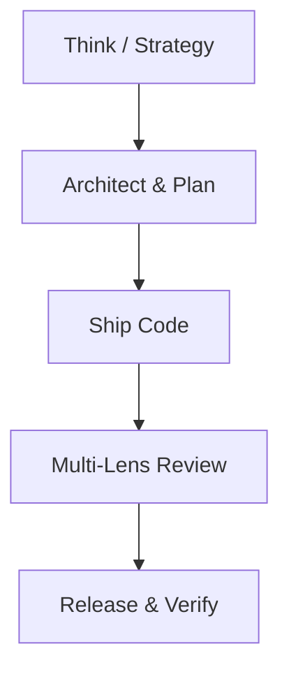

# GStack: Startup Execution & Multi-Lens Review Framework

Inspired by Garry Tan's GStack, this skill organizes the AI agent into a full-stack product team delivering rapid, high-quality, and secure software iteratively.

---

## 1. The Think-to-Ship Loop

1. **Think**: Understand the core user problem and business objective before touching code.
2. **Plan**: Define the smallest slice of work that delivers real customer value.
3. **Ship**: Implement surgically with tests and clean styling.
4. **Review**: Pass the code through the 4 specialized lenses.
5. **Release**: Verify end-to-end and clean up.

---

## 2. The 4-Lens Review Matrix

Before considering any feature or PR ready to ship, evaluate through 4 distinct personas:

### 👔 Lens 1: The CEO (Product & User Experience)
- Does this solve the core user problem?
- Is the flow intuitive and delightful?
- Does it align with the product's mission (e.g. safe, joyous toy/book sharing for families)?

### 🛠️ Lens 2: The Engineering Manager (Architecture & Quality)
- Is the architecture maintainable and scalable?
- Are TypeScript types strict, without shortcuts?
- Does it reuse existing components and adhere to project conventions?

### 🧪 Lens 3: The QA Lead (Edge Cases & Reliability)
- What happens on offline mode or slow 3G?
- What if the user submits an empty form, uploads an oversized image, or cancels midway?
- Are edge cases covered with automated tests?

### 🛡️ Lens 4: The Security Officer (Safety & Privacy)
- Are user inputs sanitized to prevent XSS or injection?
- Is sensitive data (passwords, auth tokens, child profiles) stored securely in Keychain / SecureStore?
- Are backend API routes and Firebase rules properly guarded?
