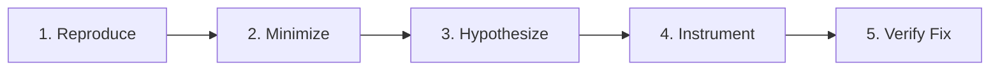

# Matt Pocock Engineering & TypeScript Mastery

This skill provides disciplined software engineering patterns for modern TypeScript, React Native, and fullstack development.

---

## 1. The 5-Step Diagnostic Protocol (`diagnosing-issues`)

When investigating a bug, regression, or crash, never jump into changing code blindly. Follow these 5 steps in order:



1. **Reproduce**: Create an automated failing test case or an exact minimal reproduction script.
2. **Minimize**: Strip away unrelated screens, Redux state, and mock data until the failure occurs with the minimum possible code.
3. **Hypothesize**: Formulate a clear, testable theory explaining *why* the bug occurs based on the code mechanics.
4. **Instrument**: Add temporary diagnostic assertions or targeted console logs to prove or disprove the hypothesis.
5. **Verify Fix**: Apply the minimal surgical fix and confirm the reproduction test passes.

---

## 2. TypeScript Hygiene & Strictness

- **Zero `any` Policy**: Use `unknown` with type guards, discriminated unions, or generic type parameters instead of `any`.
- **Discriminated Unions for State**:
  ```typescript
  type AsyncState<T> =
    | { status: 'idle' }
    | { status: 'loading' }
    | { status: 'success'; data: T }
    | { status: 'error'; error: Error };
  ```
- **Runtime Validation**: Use Zod or lightweight schema checkers to validate external API responses and AsyncStorage payloads before passing them to internal state.
- **Explicit Return Types on Public APIs**: Document exported hooks, thunks, and util functions with clear return types.

---

## 3. Safe Refactoring Protocol (`refactoring`)

- **Never refactor without green tests**: Ensure existing unit and component tests pass before starting.
- **One transformation at a time**: Rename a symbol, extract a component, or normalize state shape in isolated, atomic steps.
- **Run compiler checks**: Execute `npx tsc --noEmit` after every structural change.
