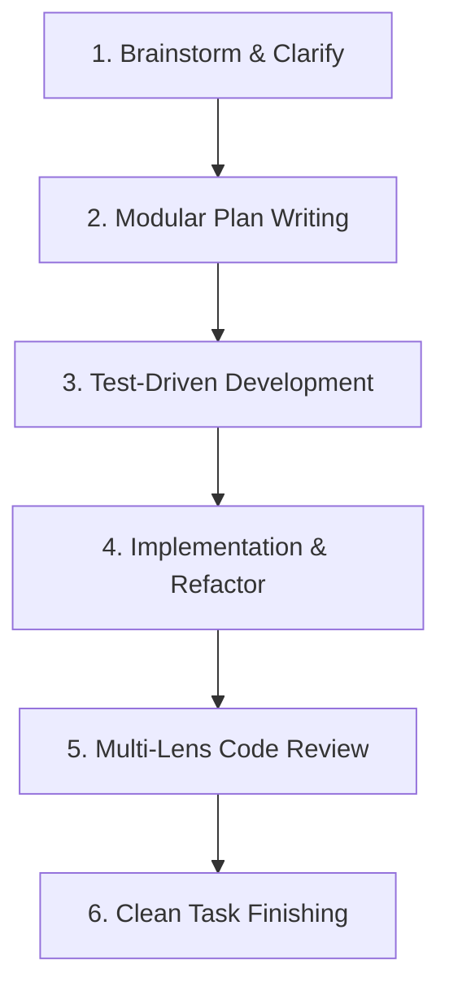

# Superpowers: Systematic Software Engineering Framework

This skill enforces a rigorous, repeatable software engineering lifecycle for AI coding agents, preventing "vibe coding" and ensuring production-grade code quality.

## Core Phases & Disciplines

---

## 1. Brainstorming & Requirements Clarification
- **Never jump straight into coding.**
- Ask probing questions to uncover edge cases, performance constraints, and user expectations.
- State assumptions explicitly and confirm domain models before writing architecture plans.
- Identify potential breaking changes in existing APIs or database schemas early.

## 2. Plan Writing (`writing-plans`)
- Break complex epics into small, bite-sized tasks (estimated 2–10 minutes each).
- Each task in the plan must define:
  1. **Goal**: Exact behavior or contract being implemented.
  2. **File targets**: Explicit paths to create or modify.
  3. **Verification criteria**: Exact unit test command, lint check, or visual assertion.
  4. **Dependencies**: What must be completed before this step begins.

## 3. Test-Driven Development (`TDD`)
- **Red Phase**: Write a failing unit or integration test that asserts the desired functionality. Run the test and confirm it fails for the expected reason.
- **Green Phase**: Write the *minimal* production code necessary to make the test pass. Avoid speculative features.
- **Refactor Phase**: Clean up code structure, deduplicate, and optimize types while keeping all tests green.

## 4. Subagent & Focused Execution
- Execute one task at a time with strict context boundaries.
- Keep each iteration laser-focused on the active plan item.
- If an unexpected roadblock or architectural defect arises, halt execution, update the implementation plan, and realign before continuing.

## 5. Code Review (`requesting-code-reviews`)
Before marking any feature as complete, conduct a rigorous self-review checking:
- **Correctness & Edge Cases**: Are nulls, empty states, network failures, and timeout errors handled?
- **Type Safety**: Are all TypeScript types strict, without `any` or loose casts?
- **Performance**: Are there memory leaks, unnecessary re-renders (in React Native), or unbounded loops?
- **Documentation**: Are complex business logic and exported APIs cleanly documented?

## 6. Finishing Tasks (`finishing-tasks`)
- Run the full test suite and TypeScript compiler checks (`tsc --noEmit`).
- Verify no temporary debug logs, commented-out dead code, or orphaned scratch files remain.
- Provide a concise summary of changes, tested flows, and next recommended actions.
