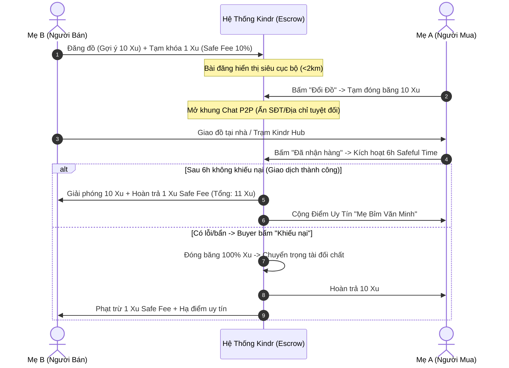
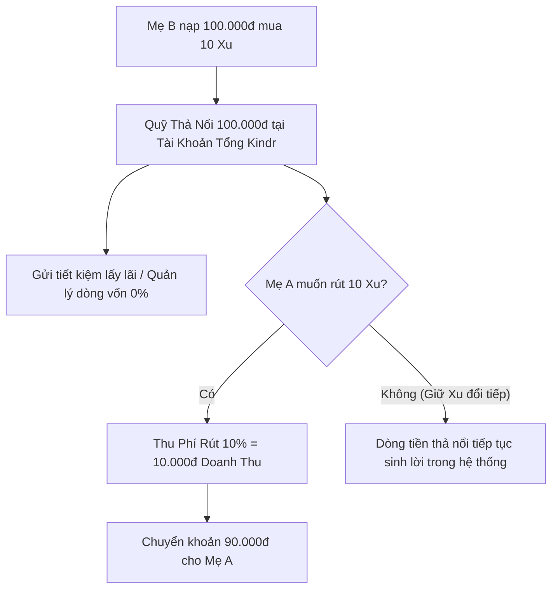

# 🧸 KINDR MASTER BLUEPRINT: CHIẾN LƯỢC KINH DOANH, KINH TẾ HÀNH VI & HƯỚNG DẪN LẬP TRÌNH TOÀN DIỆN

> **Tài liệu Single Source of Truth (SSOT)** kết hợp toàn bộ đề án F-Shark, phân tích chuyên gia 20 năm kinh nghiệm và hướng dẫn kiến trúc kỹ thuật dành cho Developer khi phát triển ứng dụng **Kindr**.

---

## 📌 MỤC LỤC
1. [Tổng Quan Đề Án & Tuyên Ngôn Giá Trị](#1-tổng-quan-đề-án--tuyên-ngôn-giá-trị)
2. [Phân Tích Thị Trường & Chỉ Số Quy Mô (TAM/SAM/SOM)](#2-phân-tích-thị-trường--chỉ-số-quy-mô-tamsamsom)
3. [Kinh Tế Hành Vi & Cơ Chế Tokenomics Lõi](#3-kinh-tế-hành-vi--cơ-chế-tokenomics-lõi)
4. [Mô Hình Kinh Doanh & Dòng Tiền Thả Nổi (Float Money)](#4-mô-hình-kinh-doanh--dòng-tiền-thả-nổi-float-money)
5. [Thiết Kế Chạm Cảm Xúc (Emotional UI/UX) & Design Tokens](#5-thiết-kế-chạm-cảm-xúc-emotional-uiux--design-tokens)
6. [Kiến Trúc Kỹ Thuật 4 Lớp & Ánh Xạ Mã Nguồn (Codebase Map)](#6-kiến-trúc-kỹ-thuật-4-lớp--ánh-xạ-mã-nguồn-codebase-map)
7. [Kịch Bản Phản Biện Hội Đồng Giám Khảo & Sharks (Defense Playbook)](#7-kịch-bản-phản-biện-hội-đồng-giám-khảo--sharks-defense-playbook)
8. [Lộ Trình Mở Rộng 3 Năm (Scalability Roadmap)](#8-lộ-trình-mở-rộng-3-năm-scalability-roadmap)

---

## 1. TỔNG QUAN ĐỀ ÁN & TUYÊN NGÔN GIÁ TRỊ

### 1.1. Thông Tin Dự Án
* **Tên Dự Án:** Kindr – Nền tảng Kinh tế Tuần hoàn & Trao đổi Đồ Trẻ Em Siêu Cục Bộ.
* **Đội thi (KBFSHARK - FPT University Da Nang):**
  * **Lô Hồng Ngọc** (CEO) - Quản trị chiến lược & Vận hành.
  * **Nguyễn Ngọc Bữu** (CTO) - Kiến trúc sư hệ thống & Backend.
  * **Trần Quang Bửu Hoàng** (UX/UI/AI) - Thiết kế trải nghiệm & AI Engine.
  * **Nguyễn Văn Hoàng** (COO) - Quản trị mạng lưới & Đối tác.
  * **Vinh Thị Ngọc Trâm** (CMO) - Tăng trưởng & Marketing cộng đồng.

### 1.2. Tuyên Ngôn Giá Trị (Value Proposition Statement)
> *"Kindr giúp các bà mẹ bỉm sữa và gia đình trẻ tại đô thị giải phóng không gian sống và tối ưu hóa 50%–70% chi phí nuôi con thông qua nền tảng trao đổi đồ dùng trẻ em siêu cục bộ (Hyper-local P2P) ứng dụng Ví Xu nội bộ và Thuật toán Ký quỹ Trách nhiệm Song phương (Double Escrow); triệt tiêu hoàn toàn nạn mặc cả, lừa đảo cọc ship và đồ rác nhờ cơ chế 6 giờ kiểm định tại nhà và mạng lưới Trạm Phường (Kindr Hub)."*

---

## 2. PHÂN TÍCH THỊ TRƯỜNG & CHỈ SỐ QUY MÔ (TAM/SAM/SOM)

```text
┌────────────────────────────────────────────────────────┐
│ TAM: $5.1 Tỷ USD (Toàn bộ thị trường đồ cũ VN 2026)   │
│ ┌────────────────────────────────────────────────────┐ │
│ │ SAM: $539 Triệu USD (Thị phần Đồ cũ Mẹ & Bé 7%)    │ │
│ │ ┌────────────────────────────────────────────────┐ │ │
│ │ │ SOM: $26.95 Triệu USD (5% SAM mục tiêu năm 1) │ │ │
│ │ └────────────────────────────────────────────────┘ │ │
│ └────────────────────────────────────────────────────┘ │
└────────────────────────────────────────────────────────┘
```

* **TAM (Total Addressable Market):** $5.1\text{ tỷ USD}$ (Quy mô thị trường hàng đã qua sử dụng tại VN theo VnBusiness).
* **SAM (Serviceable Addressable Market):** $539\text{ triệu USD}$ (Tương đương 10.6 triệu món đồ mẹ & bé trong tổng số 159 triệu mặt hàng đồ cũ theo báo cáo Carousell/Chợ Tốt $\approx 7\%$).
* **SOM (Serviceable Obtainable Market):** $26.95\text{ triệu USD}$ (Mục tiêu chiếm lĩnh 5% SAM trong năm đầu tiên tại các đô thị trọng điểm: Đà Nẵng, TP.HCM, Hà Nội).

### 3 Điểm Đau Trần Trụi Của Khách Hàng (Customer Pain Points)
1. **Khủng hoảng Không gian sống (Space Anxiety):** Trẻ phát triển nhận thức và thể chất theo từng tháng tuổi $\rightarrow$ đồ chơi chán sau 36 ngày, quần áo chật sau 90 ngày $\rightarrow$ nhà cửa biến thành bãi chiến trường, vứt thì tiếc mà giữ thì chật.
2. **Ma sát Giao dịch & Ám ảnh mặc cả:** Đăng lên Facebook/Chợ Tốt mất cả ngày chỉ để trả lời tin nhắn, bị kỳ kèo ép giá từ 100k xuống 20k, rủi ro bị bùng hàng và trôi bài sau 15 phút.
3. **Khủng hoảng Niềm tin & Sợ mầm bệnh:** Sợ nhận phải đồ chơi bẩn, vi khuẩn, bệnh tay chân miệng từ người lạ hoắc trên mạng mà không có bất kỳ bên nào bảo chứng.

---

## 3. KINH TẾ HÀNH VI & CƠ CHẾ TOKENOMICS LÕI



### 3.1. Định Giá Chuẩn Hóa & Thuật Toán Khung Giá Cố Định
* **Quy chuẩn tỷ giá vàng:**
  $$\mathbf{1\text{ Xu} = 10.000\text{ VNĐ}}$$
* **Khung định giá cố định (Price Anchoring System):**
  * **Sách / Truyện tranh:** Mới 70% ($1\text{ Xu}$) | Mới 90% ($2\text{ Xu}$).
  * **Đồ chơi nhỏ (Xe mô hình, búp bê):** Mới 70% ($2\text{ Xu}$) | Mới 90% ($4\text{ Xu}$).
  * **Đồ chơi lớn (Lego, xe chòi chân):** Mới 70% ($5\text{ Xu}$) | Mới 90% ($10\text{ Xu}$).
  * **Đồ dùng cồng kềnh (Xe đẩy, nôi cũi):** Mới 70% ($15\text{ Xu}$) | Mới 90% ($30\text{ Xu}$).
* *Tác dụng:* Người bán chỉ được điều chỉnh giá trong biên độ hẹp được thiết lập sẵn, triệt tiêu hoàn toàn tình trạng "ngáo giá" hay mặc cả.

### 3.2. Cơ Chế Ký Quỹ Kép (Double Escrow Mechanism)
* **Người bán:** Tạm khóa **10% Safe Fee** (Phí cam kết chất lượng) khi đăng bài.
* **Người mua:** Tạm đóng băng **100% giá trị món đồ** khi bấm Đổi đồ.
* **6 Hours Safeful Time:** Khoảng đệm 6 tiếng sau khi nhận đồ để người mua kiểm tra lỗi ẩn, vệ sinh tại nhà trước khi dòng tiền được giải ngân.

### 3.3. Vòng Lặp Tuần Hoàn Đóng (Gamification Retention Loop)
* Áp dụng **Hiệu ứng sở hữu (Endowment Effect)**: Xu trong app không cho rút ra tiền mặt miễn phí $\rightarrow$ Tâm lý tiếc nuối thúc đẩy người mẹ liên tục lướt app tìm đồ mới cho con $\rightarrow$ Hết Xu lại gom đồ cũ đăng bài $\rightarrow$ Tự động sản sinh nguồn cung với chi phí tiếp thị $\text{CAC} \approx 0$.

### 3.4. Chống Lạm Phát Xu & Bẫy "Chợ Trống" (Welcome Credit Rules)
* Người dùng mới được tặng **5–10 Xu Chào Mừng (Welcome Credit)**.
* **Luật bảo vệ:** Welcome Credit là `Non-withdrawable Points`, **chỉ dùng để ký quỹ Safe Fee 10%** cho các bài đăng đầu tiên.
* **Quy tắc 50%:** Người mua chỉ được dùng tối đa 50% Xu tặng để đổi đồ; muốn đổi đồ giá trị cao hơn bắt buộc phải đăng bài cho đồ để tích thêm Xu thật.

---

## 4. MÔ HÌNH KINH DOANH & DÒNG TIỀN THẢ NỔI (FLOAT MONEY)



### 1. Phí Rút Tiền Mặt (10% Cash-out Fee)
* Khi người bán tích lũy được Xu và muốn rút về tài khoản ngân hàng (VietQR), Kindr thu phí **10%** trên tổng giá trị rút (Ví dụ: Rút 10 Xu = 100k $\rightarrow$ nhận 90k, Kindr giữ lại 10k doanh thu thuần).

### 2. Khai Thác Dòng Vốn Thả Nổi (Float Money Management - Mô hình Starbucks & Shopee)
* Tiền mặt nạp vào mua Xu và tiền cọc đóng băng trong hệ thống nằm im trong tài khoản ngân hàng của doanh nghiệp từ vài tuần đến vài tháng.
* Với $10.000\text{ user} \times 50.000\text{đ nhàn rỗi} = \mathbf{500.000.000\text{ VNĐ}}$ vốn lưu động lãi suất 0% để tối ưu tài chính an toàn.

### 3. Dịch Vụ Gia Tăng & Nguồn Thu Phụ Trợ
* **Kindr Clean (Khử khuẩn UV):** Thu 15.000đ (hoặc 1.5 Xu)/món đồ chơi khi giao dịch qua trạm.
* **Đẩy tin VIP (Paid Bumping):** Thu 5.000đ/lần đẩy bài lên trang đầu.
* **Kindr Hub (Trạm Phường B2B2C):** Chia sẻ hoa hồng với tiệm tạp hóa/trường mầm non làm điểm giao nhận (1.000đ/đơn).
* **Xu hao mòn (Token Demurrage):** Khấu trừ 5% số dư Xu mỗi tháng nếu tài khoản "bất động" quá 6 tháng để kích thích thanh khoản.

---

## 5. THIẾT KẾ CHẠM CẢM XÚC (EMOTIONAL UI/UX) & DESIGN TOKENS

### 5.1. Bảng Màu Pastel Ấm Áp (Tham khảo `DESIGN.md`)
* `primary`: `#FF6B6B` (San hô ấm áp - Nút CTA, điểm nhấn chính).
* `secondary`: `#4ECDC4` (Xanh ngọc dịu mát - Danh mục, huy hiệu an toàn).
* `accent`: `#FFD166` (Vàng nắng ấm - Huy hiệu Xu lấp lánh, sao đánh giá).
* `background`: `#F8F9FA` (Trắng kem pastel - Nhẹ nhàng, không gây chói mắt).
* `card`: `#FFFFFF` (Bề mặt thẻ nổi 1px viền `rgba(0,0,0,0.06)`).
* `text`: `#1A1D20` (Xám than đậm - Dễ đọc, tương phản WCAG AA).

### 5.2. Nhân Vật Mascot Đồng Hành (Gấu Kindr Buddy) & Micro-Copy
* **Splash & Onboarding:** *"Chào mừng mẹ đến với ngôi nhà chung Kindr!"*
* **Ký quỹ Safe Fee:** *"Mẹ gửi tạm 1 Xu vào rương để Gấu giữ hộ cho an toàn nhé! ❤️"*
* **Đăng bài thành công:** *"Tuyệt quá mẹ ơi! Món đồ chơi của bé đã lên sàn rồi nè!"*
* **Ví Xu:** *"Trong ví của mẹ đang có 15 Xu lấp lánh, đổi quà cho bé thôi nào! 🟡"*

### 5.3. Quy Chuẩn Công Thái Học (Mobile Ergonomics)
* Touch target tối thiểu $\mathbf{\ge 44 \times 44\text{pt}}$ cho mọi nút bấm và icon.
* Bo tròn góc mềm mại: `radius-md: 12pt`, `radius-lg: 18pt`, `radius-full: 9999pt`.
* Luôn bọc màn hình bằng `SafeAreaView` và hỗ trợ `KeyboardAvoidingView`.

---

## 6. KIẾN TRÚC KỸ THUẬT 4 LỚP & ÁNH XẠ MÃ NGUỒN (CODEBASE MAP)

```text
d:\Kindr\src/
├── 1. Presentation Layer (Giao diện 30 màn hình)
│   ├── features/auth/screens/          # OnboardingScreen, LoginScreen, RegisterScreen
│   ├── features/home/screens/          # HomeScreen, ProductDetailScreen, SearchScreen
│   ├── features/post/screens/          # PostItemScreen, MyPostsScreen, DonationStationScreen
│   ├── features/exchange/screens/      # TransactionDetailScreen, DisputeFormScreen
│   ├── features/profile/screens/       # WalletScreen, TopUpScreen, WithdrawScreen, ProfileScreen
│   ├── features/chat/screens/          # ChatListScreen, ChatDetailScreen
│   ├── features/grade/screens/         # RatingReviewScreen (Mẹ bỉm văn minh)
│   └── features/admin/screens/         # AdminDashboard, ManageDisputes, ManageTransactions
│
├── 2. State Management Layer (Redux Toolkit)
│   ├── app/store/rootReducer.ts        # Hợp nhất reducers
│   ├── features/auth/authSlice.ts      # Quản lý User, Session, Welcome Credit
│   ├── features/post/postSlice.ts      # Danh sách bài đăng, lọc Phường/Quận, cọc 10%
│   └── features/exchange/exchangeSlice.ts # Quản lý Double Escrow, đếm ngược 6h Safeful
│
├── 3. Service & API Layer
│   ├── services/api.ts                 # Base API client
│   ├── services/vietqrService.ts       # Sinh mã VietQR nạp Xu tự động
│   └── services/mockDataService.ts     # Dữ liệu mẫu chuẩn thực tế phục vụ demo
│
└── 4. Type Definitions & Domain Models (src/types/)
    ├── common.ts                       # Product, Transaction, CategoryType, ConditionType
    ├── user.ts                         # User, ReputationScore, WelcomeCredit
    └── notification.ts                 # Notification items, Push payloads
```

---

## 7. KỊCH BẢN PHẢN BIỆN HỘI ĐỒNG GIÁM KHẢO & SHARKS (DEFENSE PLAYBOOK)

### ❓ Câu Hỏi 1: "Tại sao các mẹ không bán trên Facebook hay Chợ Tốt cho nhanh?"
> **💡 Trả lời:** *"Thưa Hội đồng, bán tiền mặt trên Facebook sinh ra 2 ma sát chí mạng: **Tâm lý mặc cả** (mất cả ngày chỉ để kỳ kèo 20k) và **Hiệu ứng sở hữu** (tiếc kỷ niệm nên hét giá cao $\rightarrow$ không ai mua $\rightarrow$ nhà vẫn chật). Kindr dùng **Ví Xu nội bộ và khung định giá chuẩn**, biến món đồ cũ thành cơ hội đổi đồ mới cho con trong 30 giây mà không cần mặc cả một lời."*

### ❓ Câu Hỏi 2: "Mô hình này lấy nguồn thu từ đâu để nuôi bộ máy?"
> **💡 Trả lời:** *"Kindr có 3 nguồn thu bền vững:
> 1. **Phí rút tiền mặt 10%** khi người dùng quy đổi Xu thành tiền mặt.
> 2. **Tận dụng dòng tiền thả nổi (Float Money)** từ tiền nạp mua Xu và tiền cọc đóng băng trong tài khoản tổng (mô hình Starbucks).
> 3. **Phí dịch vụ giá trị gia tăng** như Khử khuẩn đồ chơi Kindr Clean (15k/món) và Phí đẩy tin VIP."*

### ❓ Câu Hỏi 3: "Làm sao chống tình trạng gian lận, giao đồ rách hỏng?"
> **💡 Trả lời:** *"Chúng em quản lý bằng **Thuật toán kinh tế hành vi (Double Escrow)**: Người bán phải ký quỹ **10% Safe Fee**, người mua có **6 giờ kiểm định tại nhà**. Giao đồ gian lận sẽ bị tịch thu toàn bộ tiền cọc để bồi thường cho người mua và bị đánh tụt điểm uy tín **Mẹ Bỉm Văn Minh**. Người dùng buộc phải hành xử tử tế để bảo vệ lợi ích kinh tế của chính mình."*

---

## 8. LỘ TRÌNH MỞ RỘNG 3 NĂM (SCALABILITY ROADMAP)

* **Năm 1 (MVP & Product-Market Fit tại Đà Nẵng):**
  * Tập trung cốt lõi vào danh mục Đồ chơi & Sách truyện tại các quận Hải Châu, Thanh Khê, Sơn Trà.
  * Hoàn thiện 100% luồng Double Escrow, nạp VietQR và hệ thống Điểm uy tín.
* **Năm 2 (Mở rộng Danh mục & Mạng lưới Trạm Phường Kindr Hub):**
  * Mở rộng sàn sang Xe đẩy, Nôi cũi, Ghế ăn dặm, Quần áo trẻ em và Đồ bầu.
  * Hợp tác với 50+ trường mầm non & tiệm tạp hóa lập mạng lưới **Kindr Hub**.
* **Năm 3 (Siêu Ứng Dụng Kinh Tế Tuần Hoàn Toàn Quốc):**
  * Mở rộng ra Hà Nội, TP.HCM. Tích hợp Widget Sổ tay tiêm chủng, biểu đồ tăng trưởng WHO và Gian hàng B2C OCOP/Tã sữa.
