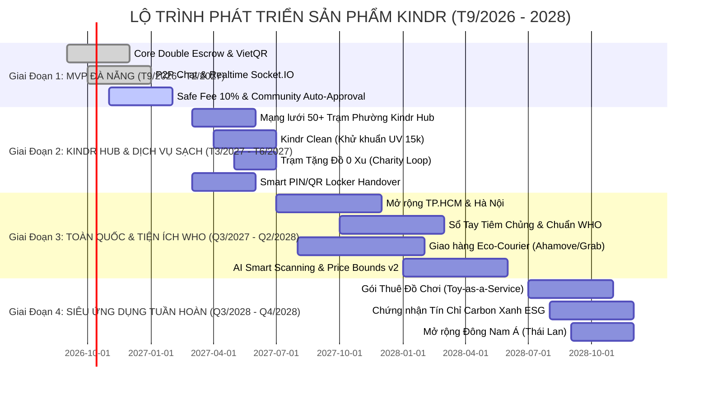

# 🗺️ KINDR PRODUCT ROADMAP (2026 – 2028)
## CHIẾN LƯỢC PHÁT TRIỂN SẢN PHẨM & LỘ TRÌNH MỞ RỘNG QUY MÔ TOÀN DIỆN

> **Tài liệu chiến lược cấp cao (Executive Strategic Document)** dành cho Nhà sáng lập, Hội đồng Cố vấn, Ban Giám khảo (F-Shark / Khởi nghiệp Đổi mới sáng tạo) và Đội ngũ Kỹ thuật nòng cốt của dự án **Kindr**.

<div align="center">
  
  <p><i>Sơ đồ trực quan Timeline Gantt Product Roadmap Kindr theo 4 luồng chuyên môn (Development, Product, UX, QA) và tiến độ thời gian (2026 – 2028)</i></p>
</div>

---

## 📌 MỤC LỤC
1. [Tầm Nhìn Sản Phẩm & Trụ Cột Chiến Lược (Vision & Strategic Pillars)](#1-tầm-nhìn-sản-phẩm--trụ-cột-chiến-lược)
2. [Khung Lộ Trình Phát Triển (Roadmap Horizon Overview)](#2-khung-lộ-trình-phát-triển)
3. [Chi Tiết Lộ Trình Theo Từng Giai Đoạn (Phase-by-Phase Roadmap)](#3-chi-tiết-lộ-trình-theo-từng-giai-đoạn)
   * [Giai Đoạn 1 (Q1 – Q2/2026): MVP & Product-Market Fit (Đà Nẵng Launchpad)](#giai-đoạn-1-q1--q22026-mvp--product-market-fit-đà-nẵng-launchpad)
   * [Giai Đoạn 2 (Q3 – Q4/2026): Hyperlocal Density & Mạng Lưới Trạm Phường (Kindr Hub)](#giai-đoạn-2-q3--q42026-hyperlocal-density--mạng-lưới-trạm-phường-kindr-hub)
   * [Giai Đoạn 3 (2027): Đô Thị Hóa Toàn Quốc & Hệ Sinh Thái Nuôi Con Toàn Diện](#giai-đoạn-3-2027-đô-thị-hóa-toàn-quốc--hệ-sinh-thái-nuôi-con-toàn-diện)
   * [Giai Đoạn 4 (2028): Siêu Ứng Dụng Kinh Tế Tuần Hoàn & Vươn Ra Khu Vực](#giai-đoạn-4-2028-siêu-ứng-dụng-kinh-tế-tuần-hoàn--vươn-ra-khu-vực)
4. [Lộ Trình Tiến Hóa Kiến Trúc Kỹ Thuật (Tech Stack & Architecture Evolution)](#4-lộ-trình-tiến-hóa-kiến-trúc-kỹ-thuật)
5. [Khung Chỉ Số Đo Lường Hiệu Quả (North Star & OKRs/KPIs)](#5-khung-chỉ-số-đo-lường-hiệu-quả)
6. [Quản Trị Rủi Ro & Cơ Chế Kinh Tế Hành Vi (Risk Matrix & Behavioral Guardrails)](#6-quản-trị-rủi-ro--cơ-chế-kinh-tế-hành-vi)
7. [Phân Bổ Nguồn Lực & Trách Nhiệm Đội Ngũ (Resource Allocation & RACI Matrix)](#7-phân-bổ-nguồn-lực--trách-nhiệm-đội-ngũ)

---

## 1. TẦM NHÌN SẢN PHẨM & TRỤ CỘT CHIẾN LƯỢC

### 1.1. Tuyên Ngôn Tầm Nhìn (Product Vision)
> **"Trở thành nền tảng kinh tế tuần hoàn siêu cục bộ số 1 tại Việt Nam dành cho 10 triệu gia đình trẻ, định hình phong cách nuôi con văn minh, tiết kiệm và không rác thải thông qua thuật toán kinh tế hành vi và mạng lưới cộng đồng tự quản."**

### 1.2. 4 Trụ Cột Chiến Lược (The 4 Strategic Pillars)

```
┌────────────────────────────────────────────────────────────────────────┐
│                   4 TRỤ CỘT CHIẾN LƯỢC KINDR                          │
├─────────────────┬──────────────────┬──────────────────┬────────────────┤
│ 1. ZERO-FRICTION│ 2. COMMUNITY     │ 3. HYPERLOCAL    │ 4. SUSTAINABLE │
│    EXCHANGE     │    TRUST         │    DENSITY       │    FLOAT       │
│                 │                  │                  │                │
│ • Không tiền mặt│ • Double Escrow  │ • Bán kính <2km  │ • 10% Cashout  │
│ • Không mặc cả  │ • 10% Safe Fee   │ • Trạm Kindr Hub │ • Dòng tiền nạp│
│ • Khung định giá│ • 6h Safeful Time│ • Tiện đường học │ • Dịch vụ VIP  │
│ • Giao dịch 30s │ • Mẹ Bỉm Văn Minh│ • Không cước ship│ • Khử khuẩn UV │
└─────────────────┴──────────────────┴──────────────────┴────────────────┘
```

1. **Zero-Friction Exchange (Trao đổi không ma sát):** Khung định giá cố định chống ngáo giá, xoá bỏ văn hoá kỳ kèo 20k trên mạng xã hội. Dùng điểm Xu nội bộ giúp các mẹ dễ dàng chia tay đồ chơi cũ của bé mà không cảm thấy mất mát.
2. **Community Trust & Hygiene Safety (Niềm tin & Vệ sinh tuyệt đối):** Giải quyết triệt để nỗi sợ lừa đảo và mầm bệnh thông qua thuật toán Ký quỹ Kép (Double Escrow), 10% Safe Fee cam kết trách nhiệm và 6 tiếng kiểm tra đồ tại nhà.
3. **Hyperlocal Density (Mật độ siêu cục bộ):** Đổi đồ trong bán kính đi bộ (<2km), biến các trường mầm non và quán cà phê thân thiện thành **Kindr Hub**, giảm 100% áp lực đóng gói và chi phí vận chuyển.
4. **Sustainable Float & Circular Monetization (Mô hình tài chính thả nổi bền vững):** Áp dụng mô hình ngân hàng Starbucks: Thu phí 10% khi rút tiền mặt và tận dụng dòng tiền nhàn rỗi (Float Money) từ tiền nạp mua Xu trong tài khoản ký quỹ.

---

## 2. KHUNG LỘ TRÌNH PHÁT TRIỂN (ROADMAP HORIZON OVERVIEW)

### 2.1. Ma Trận Swimlane Roadmap Theo Khung Năng Lực (Functional Tracks Matrix)

<div align="center">
  
  <p><i>Ma trận Swimlane Roadmap chi tiết chuẩn xác theo 4 mốc phát hành (1.1, 1.2, 1.3, 2.1) và 4 luồng chuyên môn (Development, Product, UX, QA)</i></p>
</div>

| Khung Năng Lực (Tracks) | Release 1.1 (MVP Launch) | Release 1.2 (Community Growth) | Release 1.3 (Scaling & Logistics) | Release 2.1 (Ecosystem & Super-App) |
| :--- | :--- | :--- | :--- | :--- |
| 🟩 **DEVELOPMENT**<br>*(Kỹ thuật & Hệ thống)* | • Front-End App (Expo SDK 56)<br>• Double Escrow CAS Engine<br>• Dynamic VietQR Webhook<br>• Socket.IO Real-time Chat | • Kindr Hub Portal Web<br>• Redis State Caching<br>• Smart QR/PIN Handover<br>• Cloudinary Image Pipeline | • Geo-clustering API (<2km)<br>• Logistics Dispatch Webhook<br>• Automated Cron Finalizer<br>• Batch Push Service | • AI Vision Item Defect Scan<br>• WHO Health Tracker API<br>• Microservices Multi-city<br>• Database Sharding |
| 🟦 **PRODUCT**<br>*(Chiến lược & Nghiệp vụ)* | • MVP Scope Definition<br>• Khung giá cứng chống ngáo<br>• Quy chế ký quỹ 10% Safe Fee<br>• 6h Safeful Time Inspection | • Kindr Hub Pilot (50 Trạm)<br>• Tủ đồ thông minh (Locker)<br>• Điểm Mẹ Bỉm Văn Minh<br>• Phân hệ Trạm Tặng Đồ 0 Xu | • Kindr Clean (Khử khuẩn 15k)<br>• Hợp tác Gom chuyến Eco<br>• Cơ chế Chợ Thanh Lý VIP<br>• Khảo sát phản hồi thực địa | • Sổ Tay Tiêm Chủng Quốc Gia<br>• Hộp Đồ Chơi Luân Chuyển TaaS<br>• B2C Organic Diaper/Milk<br>• Mở rộng thị trường TP.HCM/HN |
| 🟧 **UX / UI**<br>*(Thiết kế & Cảm xúc)* | • Wireframes & User Flows<br>• Mascot Gấu Kindy tương tác<br>• Khung chat P2P che SĐT/nhà<br>• Mobile touch ergonomics $\ge$44pt | • Bản đồ Trạm Phường tương tác<br>• Tem xanh Kindr Clean seal<br>• Giao diện Tặng Đồ nhân ái<br>• Mascot trạng thái vui vẻ/bảo vệ | • UI Theo dõi lộ trình P2P<br>• Luồng khiếu nại đối soát êm đẹp<br>• Card sản phẩm thiết kế v2<br>• Thông báo đẩy cá nhân hóa | • Dashboard sức khỏe bé chuẩn WHO<br>• Thẻ Hộ Chiếu Xanh ESG<br>• Dark Mode & Đa ngôn ngữ<br>• Giao diện Bồi thẩm đoàn Mẹ bỉm |
| 🟨 **QA & SECURITY**<br>*(Chất lượng & Bảo mật)* | • CAS Anti-Double Spend Audit<br>• Unit & Integration Tests<br>• WCAG AA Contrast Test<br>• Flow tạo bài & duyệt tức thì | • Kiểm thử bảo mật mã PIN/QR<br>• Test tải webhook nạp tiền<br>• Kiểm định ẩn danh dữ liệu mẹ bé<br>• Pilot testing 100 mẹ bỉm | • Thử nghiệm tải 10,000 req/s<br>• Đối soát tài chính rương Escrow<br>• Kiểm thử xử lý tranh chấp 6h<br>• UAT thực địa tại các phường | • UAT diện rộng TP.HCM & Hà Nội<br>• Security Audit & Penetration Test<br>• Tuân thủ bảo vệ dữ liệu trẻ em<br>• Đánh giá chuẩn ISO/IEC 27001 |

### 2.2. Biểu Đồ Tiến Trình Thời Gian (Gantt Timeline)



---

## 3. CHI TIẾT LỘ TRÌNH THEO TỪNG GIAI ĐOẠN

### GIAI ĐOẠN 1 (T9/2026 – T2/2027): MVP & PRODUCT-MARKET FIT (ĐÀ NẴNG LAUNCHPAD)
> **Trọng tâm:** Chứng minh Product-Market Fit tại 3 quận trung tâm Đà Nẵng (Hải Châu, Thanh Khê, Sơn Trà); kiểm chứng vòng lặp kinh tế tuần hoàn bằng Ví Xu và cơ chế Double Escrow.

#### 1. Tính năng & Sản phẩm hoàn thiện (Features Delivered)
* **Ví Xu & Tỷ giá vàng:** Chuẩn hóa quy ước $1\text{ Xu} = 10.000\text{ VNĐ}$. Tích hợp tạo mã nạp VietQR động với `transferCode` tự động khớp giao dịch qua webhook ngân hàng.
* **Cơ chế Ký quỹ Kép (Double Escrow):**
  * Người bán: Tạm giữ **10% Safe Fee** khi đăng tin để cam kết đồ sạch, đúng mô tả.
  * Người mua: Tạm đóng băng **100% giá trị món đồ** khi bấm đổi.
  * Tự động hoàn trả 100% Safe Fee và chuyển Xu thanh toán khi hoàn tất.
* **6-Hour Safeful Time (Khoảng đệm 6 tiếng):** Đếm ngược thời gian thực trên màn hình chi tiết giao dịch để mẹ kiểm tra bánh xe, chi tiết đồ dùng tại nhà trước khi Xu được giải phóng.
* **P2P Handover PIN & QR Code:** Mã PIN 6 ký tự ngẫu nhiên và mã QR động bảo mật dùng để kích hoạt bàn giao mặt-đối-mặt.
* **Community-Driven Auto Approval:** Tự động kích hoạt hiển thị tin đăng lên sàn (`status: 'available'`) ngay khi hoàn tất ký quỹ 10%, không cần nhân sự kiểm duyệt thủ công.
* **Realtime Communication:** Socket.IO đẩy thông báo tin nhắn và yêu cầu đổi đồ tức thì.

#### 2. Chỉ số mục tiêu (Key Metrics & Targets)
| Chỉ số (KPI) | Mục tiêu Giai đoạn 1 |
| :--- | :--- |
| **Mẹ bỉm đăng ký kích hoạt** | $\ge 5.000\text{ người dùng}$ |
| **Số món đồ đăng sàn** | $\ge 12.000\text{ sản phẩm}$ |
| **Giao dịch đổi đồ thành công** | $\ge 7.500\text{ lượt}$ |
| **Tỷ lệ khiếu nại (Dispute Rate)** | $< 1.5\%$ |
| **Điểm hài lòng (NPS)** | $\ge 68$ |

---

### GIAI ĐOẠN 2 (T3/2027 – T6/2027): HYPERLOCAL DENSITY & MẠNG LƯỚI TRẠM PHƯỜNG (KINDR HUB)
> **Trọng tâm:** Xây dựng mạng lưới Trạm Phường Kindr Hub để triệt tiêu hoàn toàn rào cản gặp mặt người lạ; mở rộng dịch vụ giá trị gia tăng (VAS).

#### 1. Tính năng & Sản phẩm mới (Features & Initiatives)
* **Mạng lưới Trạm Phường Kindr Hub (50+ Điểm):**
  * Ký kết hợp tác với các trường mầm non tư thục, quán cà phê mẹ & bé, tiệm tạp hóa tại các ngõ phố.
  * Tủ đồ thông minh (Kindr Locker): Mẹ A gửi đồ vào tủ sáng khi đưa con đi học, Mẹ B nhập mã PIN lấy đồ chiều khi đón con mà không cần chờ đợi nhau.
  * Người giữ trạm hưởng $5\%\text{–}7\%$ hoa hồng Xu trên mỗi lượt giao dịch thành công.
* **Gói Dịch Vụ Khử Khuẩn "Kindr Clean" (15k/món):**
  * Tích hợp máy tiệt trùng tia cực tím UV-C tại mỗi Kindr Hub.
  * Đồ chơi, gấu bông được cấp tem niêm phong xanh "Kindr Clean Verified" cam kết sạch vi khuẩn 99.9%.
* **Trạm Tặng Đồ Từ Thiện (Charity Loop - 0 Xu):**
  * Phân hệ dành riêng cho các gia đình muốn cho tặng hoàn toàn đồ cũ cho các mái ấm, gia đình khó khăn.
  * Miễn 100% Safe Fee; người tặng nhận Huân Chương "Mẹ Bỉm Nhân Ái" và tích lũy Điểm Văn Minh.
* **AI Smart Vision & Valuation Engine v2:**
  * Nhận diện thương hiệu đồ chơi (Fisher-Price, Lego, Combi...) qua camera.
  * Tự động phát hiện lỗi rách, xước lớn và cảnh báo người bán điều chỉnh tình trạng về 70% hoặc 80%.

#### 2. Chỉ số mục tiêu (Key Metrics & Targets)
| Chỉ số (KPI) | Mục tiêu Giai đoạn 2 |
| :--- | :--- |
| **Người dùng hoạt động hàng tháng (MAU)** | $\ge 25.000\text{ MAU}$ |
| **Số trạm Kindr Hub hoạt động** | $\ge 50\text{ trạm tại Đà Nẵng}$ |
| **Dòng tiền nhàn rỗi (Float Money)** | $\ge 500.000.000\text{ VNĐ}$ |
| **Tỷ lệ giữ chân người dùng D30 (Retention)** | $\ge 42\%$ |
| **Số món đồ được làm sạch qua Kindr Clean** | $\ge 3.000\text{ lượt}$ |

---

### GIAI ĐOẠN 3 (Q3/2027 – Q2/2028): ĐÔ THỊ HÓA TOÀN QUỐC & HỆ SINH THÁI NUÔI CON TOÀN DIỆN
> **Trọng tâm:** Mở rộng thị trường ra 2 đại đô thị trọng điểm: TP. Hồ Chí Minh & Hà Nội; tích hợp các tiện ích gia tăng giữ chân mẹ bỉm sữa trọn đời.

#### 1. Tính năng & Sản phẩm mới (Features & Initiatives)
* **Chiến dịch "Bắc - Nam Siêu Cục Bộ":**
  * Triển khai cụm đô thị dày đặc: TP. Thủ Đức, Quận 7, Tân Bình (TP.HCM); Cầu Giấy, Nam Từ Liêm, Ba Đình (Hà Nội).
  * Mục tiêu 300+ Trạm Phường Kindr Hub tại các chung cư cao tầng và trường học.
* **Sổ Tay Tiêm Chủng Quốc Gia Tích Hợp (Vaccine Smart Tracker):**
  * Đồng bộ lịch tiêm chủng mở rộng và tiêm dịch vụ theo tháng tuổi của bé.
  * Tự động gửi thông báo đẩy nhắc lịch trước 3 ngày; định vị trung tâm tiêm chủng VNVC/Trạm y tế phường gần nhất.
* **Biểu Đồ Tăng Trưởng WHO & Gợi Ý Đồ Chơi Theo Giai Đoạn:**
  * Theo dõi chiều cao, cân nặng của bé chuẩn WHO.
  * **Thuật toán dự đoán nhu cầu:** Khi bé tròn 12 tháng tuổi, ứng dụng tự động gợi ý mẹ đăng thanh lý xe nôi nằm và hiển thị đồ chơi phát triển vận động (xe tập đi, sách vải tương tác) của các mẹ cùng khu chung cư.
* **Tích hợp Vận Chuyển Xanh Theo Chặng Ngắn (Eco-Courier Integration):**
  * Liên kết API với Ahamove / GrabExpress gói giao hàng gom chuyến siêu tiết kiệm trong quận (15k - 20k/chuyến).
* **Gian Hàng Xanh B2C (Circular Brand Marketplace):**
  * Các thương hiệu tã sữa hữu cơ, đồ ăn dặm OCOP tài trợ voucher đổi bằng Điểm Văn Minh của người dùng.

#### 2. Chỉ số mục tiêu (Key Metrics & Targets)
| Chỉ số (KPI) | Mục tiêu Giai đoạn 3 |
| :--- | :--- |
| **Người dùng hoạt động hàng tháng (MAU)** | $\ge 200.000\text{ MAU}$ |
| **Số Trạm Phường Kindr Hub toàn quốc** | $\ge 300\text{ trạm}$ |
| **Tổng giá trị giao dịch tháng (GMV)** | $\ge 500.000\text{ Xu} \approx 5\text{ Tỷ VNĐ/tháng}$ |
| **Doanh thu phí rút tiền & Float** | $\ge 2.5\text{ Tỷ VNĐ/năm}$ |
| **Thời gian trung bình đổi thành công** | $< 4\text{ giờ kể từ khi đăng}$ |

---

### GIAI ĐOẠN 4 (Q3/2028 – Q4/2028): SIÊU ỨNG DỤNG KINH TẾ TUẦN HOÀN & VƯƠN RA KHU VỰC
> **Trọng tâm:** Mở rộng mô hình dịch vụ thuê đồ chơi định kỳ (Toy-as-a-Service), chứng chỉ tín chỉ carbon cho gia đình và nhân bản mô hình sang Đông Nam Á (Thái Lan, Indonesia).

#### 1. Tính năng & Sản phẩm mới (Features & Initiatives)
* **Toy-as-a-Service (TaaS - Gói Thuê Đồ Chơi Định Kỳ):**
  * Hộp đồ chơi giáo dục Montessori luân chuyển hàng tháng: 1 chiếc rương gồm 5 món đồ chơi được giao đến nhà mỗi tháng, tháng sau nhận rương mới và trả rương cũ.
* **Hộ Chiếu Xanh Gia Đình (Family Carbon Footprint & Green Certificate):**
  * Thuật toán quy đổi số kg rác thải nhựa và lượng $\text{CO}_2$ giảm thiểu khi tái sử dụng đồ cũ.
  * Cấp chứng chỉ ESG cho các gia đình và trường mầm non văn minh.
* **Hội Đồng Trọng Tài Mẹ Bỉm (Decentralized Community Jury):**
  * Ứng dụng mô hình bồi thẩm đoàn cộng đồng: Các ca tranh chấp phức tạp được gửi ẩn danh cho 5 Mẹ Bỉm có điểm Uy Tín trên 95 bỏ phiếu biểu quyết, nhận thưởng Xu công lý.
* **Quốc Tế Hóa (Regional Expansion):**
  * Thí điểm phiên bản tiếng Anh và tiếng Thái tại Bangkok và Chiang Mai (Thị trường đồ cũ mẹ & bé Đông Nam Á quy mô 4.2 tỷ USD).

---

## 4. LỘ TRÌNH TIẾN HÓA KIẾN TRÚC KỸ THUẬT

```
┌────────────────────────────────────────────────────────────────────────┐
│                      LỘ TRÌNH NÂNG CẤP HỆ THỐNG                        │
├─────────────────┬──────────────────┬──────────────────┬────────────────┤
│ GIAI ĐOẠN 1     │ GIAI ĐOẠN 2      │ GIAI ĐOẠN 3      │ GIAI ĐOẠN 4    │
│ (Monolith Tinh) │ (Event-Driven)   │ (Microservices)  │ (Distributed)  │
├─────────────────┼──────────────────┼──────────────────┼────────────────┤
│ • Express + TS  │ • Redis Pub/Sub  │ • Microservices: │ • Multi-region │
│ • MongoDB Atlas │ • BullMQ Worker  │   - Auth/Wallet  │ • Global CDN   │
│ • Socket.IO     │ • Cloudinary CDN │   - Geolocation  │ • High-scale   │
│ • React Native  │ • Elasticsearch  │   - AI Vision    │   Fraud Engine │
│   Expo SDK 56   │   Geo-Query      │ • Kubernetes /   │ • Automated    │
│ • VietQR Static │ • SMS/Zalo OTP   │   Docker Swarm   │   ESG Oracle   │
└─────────────────┴──────────────────┴──────────────────┴────────────────┘
```

### 4.1. Kiến Trúc Cơ Sở Dữ Liệu & Giao Dịch Tài Chính
* **CAS (Compare-And-Swap) Locks:** Ngăn ngừa tuyệt đối tình trạng chi tiêu kép (Double Spending) của ví Xu trong điều kiện mạng lag hoặc nghẽn request.
* **Idempotency Keys:** Đảm bảo mọi giao dịch thanh toán hoặc trừ Safe Fee đều là toán tử lũy đẳng (Idempotent).

### 4.2. Bảo Mật & Ẩn Danh P2P
* **Che giấu số điện thoại & Địa chỉ nhà:** Số điện thoại chỉ hiển thị sau khi giao dịch ký quỹ được thiết lập thành công.
* **Vị trí tương đối:** Tọa độ hiển thị trên bản đồ luôn được thêm độ lệch ngẫu nhiên $\pm 150\text{m}$ để bảo vệ quyền riêng tư của mẹ và bé.

---

## 5. KHUNG CHỈ SỐ ĐO LƯỜNG HIỆU QUẢ (NORTH STAR & OKRs)

```
┌────────────────────────────────────────────────────────────────────────┐
│                        NORTH STAR METRIC (NSM)                         │
│                                                                        │
│          ★ SỐ LƯỢT ĐỒ DÙNG ĐƯỢC TRAO ĐỔI THÀNH CÔNG ★                  │
│                (Successful Circular Trades per Month)                  │
│                                                                        │
│ Phản ánh đồng thời: Giá trị khách hàng nhận được + Mức độ tiết kiệm   │
│ + Tác động tích cực tới môi trường đô thị + Tốc độ luân chuyển Xu.     │
└────────────────────────────────────────────────────────────────────────┘
```

### Bảng Mục Tiêu OKRs 3 Năm (2026 - 2028)

| Năm | Mục tiêu Lớn (Objective) | Kết quả then chốt (Key Results) |
| :---: | :--- | :--- |
| **2026** | **Chứng minh PMF & Thống trị Đà Nẵng** | • Đạt $25.000$ người dùng đăng ký tại Đà Nẵng.<br>• $\ge 40.000$ giao dịch thành công.<br>• Phủ sóng $50$ trạm Kindr Hub.<br>• Tỷ lệ tranh chấp $< 1\%$. |
| **2027** | **Chiếm lĩnh TP.HCM & Hà Nội** | • Đạt $200.000$ MAU toàn quốc.<br>• Mở rộng $300$ trạm Kindr Hub.<br>• Dòng tiền thả nổi duy trì $\ge 3\text{ Tỷ VNĐ}$.<br>• Doanh thu thuần $\ge 2.5\text{ Tỷ VNĐ}$. |
| **2028** | **Độc quyền Hệ sinh thái Tuần hoàn** | • $1.000.000$ người dùng hoạt động.<br>• Tiết kiệm $150\text{ Tỷ VNĐ}$ chi phí nuôi con cho cộng đồng.<br>• Giảm $500\text{ tấn}$ rác thải nhựa đồ chơi.<br>• Mở chi nhánh tại Thái Lan. |

---

## 6. QUẢN TRỊ RỦI RO & CƠ CHẾ KINH TẾ HÀNH VI

```
┌──────────────────┬──────────────────────┬──────────────────────────────┐
│ RỦI RO CHÍ MẠNG  │ TÁC ĐỘNG TIÊU CỰC    │ CHIẾN LƯỢC ĐỐI ỨNG KINDR     │
├──────────────────┼──────────────────────┼──────────────────────────────┤
│ Bẫy Chợ Trống    │ Mẹ mới tải app không │ • Tặng 10 Xu ký quỹ trải     │
│ (Cold Start)     │ thấy đồ để đổi       │   nghiệm đăng đồ đầu tiên    │
│                  │                      │ • Seed 500 món đồ chuẩn chất │
│                  │                      │   lượng cao tại mỗi phường   │
├──────────────────┼──────────────────────┼──────────────────────────────┤
│ Gian lận &       │ Giao đồ rách bẩn,    │ • Bắt buộc ký quỹ 10% SafeFee│
│ Đồ rác           │ mầm bệnh             │ • Khung 6h kiểm định tại nhà │
│                  │                      │ • Đóng băng Xu + Hạ điểm uy  │
│                  │                      │   tín khi có khiếu nại       │
├──────────────────┼──────────────────────┼──────────────────────────────┤
│ Ngáo giá &       │ Người bán hét giá    │ • Thuật toán khung giá cứng  │
│ Mặc cả           │ làm nản lòng người mua│ • Giới hạn biên độ tối đa     │
│                  │                      │ • AI gợi ý giá chuẩn theo đời│
├──────────────────┼──────────────────────┼──────────────────────────────┤
│ Rủi ro pháp lý   │ Bị coi là tiền ảo    │ • Định danh Xu là "Điểm Thưởng│
│ Điểm Thưởng      │ trái phép            │   Nội Bộ" (Loyalty Points)   │
│                  │                      │ • Áp dụng mô hình chuẩn như  │
│                  │                      │   VinID / Shopee Xu          │
└──────────────────┴──────────────────────┴──────────────────────────────┘
```

---

## 7. PHÂN BỔ NGUỒN LỰC & TRÁCH NHIỆM ĐỘI NGŨ (RACI MATRIX)

### Cơ Cấu Đội Ngũ Sáng Lập (KBFSHARK Team - FPT University Da Nang)

```
                       ┌─────────────────────────┐
                       │   LÔ HỒNG NGỌC (CEO)    │
                       │ Chiến lược & Vận hành   │
                       └────────────┬────────────┘
                                    │
       ┌────────────────────────────┼────────────────────────────┐
       │                            │                            │
┌──────┴──────────────┐   ┌─────────┴───────────┐   ┌────────────┴─────────────┐
│ NGUYỄN NGỌC BỮU     │   │ TRẦN QUANG BỬU HOÀNG│   │ NGUYỄN VĂN HOÀNG (COO)   │
│ (CTO)               │   │ (CPO / AI Engine)   │   │ VINH THỊ NGỌC TRÂM (CMO) │
│ Backend & Bảo Mật   │   │ UI/UX & Sản Phẩm    │   │ Vận Hành Trạm & Tăng Trưởng
└─────────────────────┘   └─────────────────────┘   └──────────────────────────┘
```

### Ma Trận Trách Nhiệm (RACI Matrix)

| Hạng mục công việc / Giai đoạn | CEO (Hồng Ngọc) | CTO (Ngọc Bữu) | CPO (Bửu Hoàng) | COO (Văn Hoàng) | CMO (Ngọc Trâm) |
| :--- | :---: | :---: | :---: | :---: | :---: |
| **Quy chế định giá & Khung kinh tế hành vi** | **A** | C | **R** | C | I |
| **Kiến trúc Double Escrow & Bảo mật ví** | I | **A / R** | C | I | I |
| **Thiết kế Emotional UI/UX & Mascot Kindy** | C | I | **A / R** | I | C |
| **Ký kết hợp tác Mạng lưới Kindr Hub** | **A** | I | I | **R** | C |
| **Chiến dịch Viral Mẹ Bỉm Văn Minh** | I | I | C | C | **A / R** |
| **Mở rộng thị trường TP.HCM & Hà Nội** | **A** | C | C | **R** | **R** |

* **R (Responsible):** Người trực tiếp thực thi.
* **A (Accountable):** Người chịu trách nhiệm phê duyệt cao nhất.
* **C (Consulted):** Người được tham vấn chuyên môn.
* **I (Informed):** Người được thông báo tiến độ.

---

> 🎯 **Cam Kết Thực Thi:** Bản Lộ trình Sản phẩm này là kim chỉ nam nhất quán giúp Kindr hiện thực hóa mục tiêu tối ưu chi phí nuôi con cho hàng triệu gia đình, tạo lập giá trị xã hội bền vững và sẵn sàng chinh phục các vòng thẩm định khắt khe nhất của các Quỹ đầu tư và Shark Tank.
