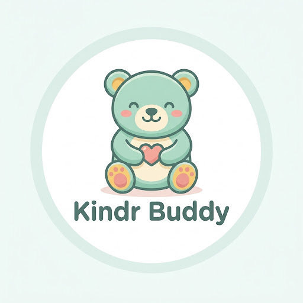
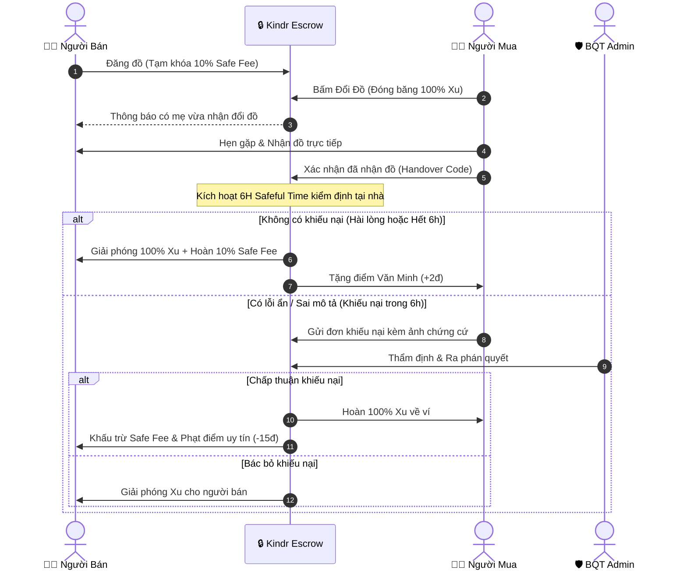

<div align="center">
  

  # Kindr
  ### Nền Tảng Trao Đổi Đồ Trẻ Em Siêu Cục Bộ & Bảo Chứng Kép (Double Escrow)

  <p align="center">
    <b>Giải pháp trao đổi đồ dùng, đồ chơi, quần áo trẻ em văn minh, tiết kiệm và an toàn tuyệt đối cho cộng đồng mẹ bỉm sữa.</b>
  </p>

  <p align="center">
    <a href="#-công-nghệ-chính-tech-stack"></a>
    <a href="#-công-nghệ-chính-tech-stack"></a>
    <a href="#-công-nghệ-chính-tech-stack"></a>
    <a href="#-công-nghệ-chính-tech-stack"></a>
    <a href="#-công-nghệ-chính-tech-stack"></a>
    <a href="#-công-nghệ-chính-tech-stack"></a>
    <a href="#-công-nghệ-chính-tech-stack"></a>
    <a href="#-bản-quyền--giấy-phép-license"></a>
  </p>
</div>

---

## 📖 Mục Lục
1. [Bối Cảnh & Tầm Nhìn Dự Án](#-1-bối-cảnh--tầm-nhìn-dự-án)
2. [Cơ Chế Cốt Lõi & Tính Năng Nổi Bật](#-2-cơ-chế-cốt-lõi--tính-năng-nổi-bật)
3. [Luồng Nghiệp Vụ Double Escrow](#-3-luồng-nghiệp-vụ-double-escrow)
4. [Công Nghệ Chính (Tech Stack)](#-4-công-nghệ-chính-tech-stack)
5. [Cấu Trúc Thư Mục (Monorepo Architecture)](#-5-cấu-trúc-thư-mục-monorepo-architecture)
6. [Hướng Dẫn Cài Đặt & Khởi Chạy](#-6-hướng-dẫn-cài-đặt--khởi-chạy)
7. [Danh Sách Tài Khoản Thử Nghiệm (Demo Accounts)](#-7-danh-sách-tài-khoản-thử-nghiệm-demo-accounts)
8. [Tiêu Chuẩn Thiết Kế & Nhận Diện](#-8-tiêu-chuẩn-thiết-kế--nhận-diện)
9. [Bản Quyền & Giấy Phép (License)](#-9-bản-quyền--giấy-phép-license)

---

## 🌟 1. Bối Cảnh & Tầm Nhìn Dự Án

Trẻ em lớn rất nhanh — các món đồ như xe đẩy, nôi cũi, máy hút sữa, quần áo sơ sinh và đồ chơi trí tuệ thường chỉ được sử dụng trong vài tháng ngắn ngủi rồi bị cất kho, gây lãng phí kinh tế đáng kể cho các gia đình trẻ và làm gia tăng gánh nặng rác thải ra môi trường.

Tuy nhiên, việc trao đổi và mua bán sang tay truyền thống trên mạng xã hội hiện nay tiềm ẩn nhiều rủi ro:
* **Lừa đảo chuyển cọc trước** rồi cắt đứt liên lạc.
* **Đồ nhận về hỏng hóc, rách bẩn hoặc sai lệch hoàn toàn so với hình ảnh đăng tải.**
* **Không có cơ chế bảo vệ quyền lợi người mua sau khi nhận đồ tại nhà.**
* **Người mua bùng hàng hoặc hủy hẹn gây mất thời gian của người bán.**

**Kindr ra đời để giải quyết triệt để vấn đề này** bằng mô hình **Trao đổi siêu cục bộ (Hyper-local P2P)**, kết hợp **Cơ chế Ký Quỹ Kép (Double Escrow)** và **6 Giờ Kiểm Định Tại Nhà (Safeful Time)** nhằm bảo vệ tối đa cả người trao và người nhận.

---

## 🛡️ 2. Cơ Chế Cốt Lõi & Tính Năng Nổi Bật

### 1. ⚖️ Ký Quỹ Kép (Double Escrow)
* **Bên Đăng Đồ (Người bán):** Tạm khóa **10% Safe Fee** từ số dư ví Xu để cam kết đồ dùng sạch sẽ, hoạt động đúng mô tả.
* **Bên Nhận Đồ (Người mua):** Tạm đóng băng **100% giá trị Xu** trong khay ký quỹ trung gian an toàn của hệ thống.
* Không bên nào nắm giữ tiền trước khi đồ được kiểm định đạt chuẩn.

### 2. ⏱️ 6 Giờ Kiểm Định Tại Nhà (6-Hour Safeful Time)
* Sau khi hai mẹ gặp nhau bàn giao đồ trực tiếp, đồng hồ đếm ngược **6 tiếng** sẽ tự động kích hoạt.
* Người mua có đủ thời gian mang đồ về nhà để tiệt trùng, kiểm tra pin, động cơ hoặc cho bé dùng thử.
* **Tự Động Quyết Toán (Auto-Finalizer):** Hết 6 tiếng nếu không có khiếu nại, Worker tự động giải phóng Xu về ví người bán và hoàn trả Safe Fee.

### 3. 🪙 Tokenomics & Điểm Văn Minh (Civil Score)
* **Ví Xu Kindr:** Quy ước cố định `1 Xu = 10.000 VNĐ`. Hỗ trợ nạp Xu tự động qua mã VietQR động.
* **Welcome Credit:** Tặng ngay **10 Xu** cho người dùng mới đăng ký để trải nghiệm trao đổi ngay (Xu thưởng khóa rút tiền mặt theo nguyên tắc kinh tế hành vi).
* **Thang Điểm Văn Minh (0 - 100đ):** Đánh giá uy tín dựa trên lịch sử giao dịch. Giao dịch đúng hẹn tăng điểm; gian lận hoặc bị khiếu nại xác thực sẽ bị trừ điểm và đình chỉ tài khoản khi tái phạm.

### 4. 🔐 Xác Thực Đa Tầng (Modern Authentication)
* **Google Sign-In chuẩn hoá:** Hỗ trợ đăng nhập nhanh 1 chạm, giao diện ấm áp đồng bộ nhận diện Kindr. Tự động tách biệt tài khoản Google khỏi luồng đặt lại mật khẩu thủ công.
* **Kích Hoạt Tài Khoản Bằng OTP Email:** Đối với người dùng đăng ký qua email bên ngoài (Outlook, Yahoo, iCloud...), hệ thống gửi mã OTP 6 chữ số để xác thực trước khi kích hoạt tài khoản.
* **Bảo mật JWT Rotation:** Cặp Access Token + Refresh Token bảo đảm an toàn phiên đăng nhập trên cả Mobile và Web.

### 5. 💬 Trò Chuyện & Thông Báo Đẩy Thời Gian Thực (Real-time Socket.IO)
* Chat P2P trực tiếp giữa hai mẹ để hẹn địa điểm giao nhận đồ.
* Tích hợp Expo Push Notification và Socket.IO real-time thông báo ngay khi có người bấm đổi đồ, nạp Xu thành công, hoặc bắt đầu khung giờ kiểm định.

### 6. 🎁 Trạm Tặng Đồ (0 Xu)
* **Trạm Tặng Đồ (0 Xu):** Danh mục phi lợi nhuận dành riêng cho các mẹ muốn san sẻ đồ dùng, quần áo, đồ chơi không còn nhu cầu sử dụng cho những gia đình khó khăn hơn hoàn toàn miễn phí.

### 7. 🛡️ Bảng Quản Trị Admin Backoffice
* 7 phân hệ quản trị toàn diện: Dashboard số liệu thống kê, Quản lý tài khoản (Khóa/Mở User), Kiểm duyệt bài đăng, Phân xử khiếu nại (Hoàn Xu / Trừ điểm), Phê duyệt yêu cầu rút tiền về ngân hàng, và Xử lý Báo cáo vi phạm.

---

## 🔄 3. Luồng Nghiệp Vụ Double Escrow



---

## 💻 4. Công Nghệ Chính (Tech Stack)

### Frontend (`client/`)
* **Framework:** React Native 0.85 + Expo SDK 56.0.0
* **Core Engine:** React 19.2.3
* **State Management:** Redux Toolkit (`@reduxjs/toolkit`)
* **Navigation:** React Navigation v7 (Native Stack + Bottom Tabs)
* **Design & Icons:** 100% Vector SVG qua `lucide-react-native` & `react-native-svg` (Không dùng icon raster hay emoji trong UI)
* **Real-time:** `socket.io-client`
* **Storage:** `expo-secure-store` (Mobile) / `localStorage` (Web)

### Backend (`server/`)
* **Runtime:** Node.js (TypeScript strict)
* **Framework:** Express.js 4.21
* **Database:** MongoDB 7+ qua Mongoose 8.14
* **Real-time Engine:** Socket.IO 4.8
* **Bảo Mật & Xác Thực:** JWT (Access + Refresh Rotation), `bcryptjs`, `helmet`, `express-rate-limit`
* **Validation:** Zod 3.25
* **Email Service:** Nodemailer (Gửi mã OTP kích hoạt tài khoản & khôi phục mật khẩu)
* **Cron Jobs:** `node-cron` (Auto-finalizer 6 giờ tự động)
* **Cloud Storage:** Cloudinary SDK v2 (Lưu trữ hình ảnh sản phẩm)

---

## 📂 5. Cấu Trúc Thư Mục (Monorepo Architecture)

```text
Kindr/
├── client/                               # 📱 Ứng dụng Frontend Mobile & Web
│   ├── assets/images/                    # Ảnh linh vật Kindr Buddy & logo thương hiệu
│   ├── src/
│   │   ├── app/
│   │   │   ├── navigation/               # AppNavigator, AuthNavigator, TabNavigator
│   │   │   └── providers/                # AuthProvider, Redux Store Provider
│   │   ├── components/
│   │   │   ├── common/                   # Button, Input, GoogleSignInButton, KindrLogo, MascotIcon...
│   │   │   ├── form/                     # FormSelect, FormError...
│   │   │   └── layout/                   # Header, ScreenContainer...
│   │   ├── features/
│   │   │   ├── admin/screens/            # 7 màn hình Backoffice Dashboard
│   │   │   ├── auth/screens/             # Login, Register, ForgotPassword, ActivateAccount...
│   │   │   ├── chat/screens/             # Chat P2P real-time
│   │   │   ├── exchange/screens/         # Quản lý ký quỹ, giao nhận & khiếu nại
│   │   │   ├── home/screens/             # Màn hình chính, Tìm kiếm, Chi tiết đồ dùng
│   │   │   ├── post/screens/             # Đăng đồ mới, Trạm tặng đồ 0 Xu
│   │   │   └── profile/screens/          # Hồ sơ, Ví Xu, Nạp/Rút Xu, Cài đặt
│   │   ├── services/                     # API client, AuthService, SocketService...
│   │   └── theme/                        # Design tokens (colors, typography, spacing, shadows)
│   └── tsconfig.json
│
├── server/                               # 🚀 Backend REST API & Real-time Server
│   ├── src/
│   │   ├── config/                       # Cấu hình Database & Biến môi trường
│   │   ├── middleware/                   # requireAuth, requireAdmin, rate-limiter...
│   │   ├── models/                       # User, Product, Transaction, Notification, Chat...
│   │   ├── routes/                       # /auth, /products, /transactions, /wallet, /admin...
│   │   ├── services/                     # escrowService, emailService...
│   │   ├── socket/                       # Socket.IO handlers (Chat & Notification push)
│   │   └── seed/                         # Dữ liệu mẫu khởi tạo hệ thống
│   └── tsconfig.json
│
├── pitch-page/                           # 🌐 Landing page giới thiệu dự án
├── DESIGN.md                             # 🎨 Quy chuẩn Design System & Accessibility
├── BACKEND_SPEC.md                       # 📋 Đặc tả API & Database Schema
├── package.json                          # Điều phối Monorepo (Concurrently)
└── README.md                             # Tài liệu dự án
```

---

## 🚀 6. Hướng Dẫn Cài Đặt & Khởi Chạy

### Yêu cầu môi trường:
* **Node.js:** Phiên bản `18.x` hoặc `20.x`
* **MongoDB:** Bản local `localhost:27017` hoặc MongoDB Atlas URI

### Bước 1: Cài đặt Dependencies
Tại thư mục gốc của dự án:
```bash
npm install
npm --prefix client install
npm --prefix server install
```

### Bước 2: Cấu hình biến môi trường
Tạo file `server/.env` dựa trên file mẫu:
```env
PORT=5000
MONGODB_URI=mongodb://localhost:27017/kindr
JWT_SECRET=kindr_super_secret_jwt_key_2026
JWT_REFRESH_SECRET=kindr_refresh_secret_key_2026
CLOUDINARY_CLOUD_NAME=your_cloud_name
CLOUDINARY_API_KEY=your_api_key
CLOUDINARY_API_SECRET=your_api_secret
SMTP_HOST=smtp.gmail.com
SMTP_PORT=587
SMTP_USER=your_email@gmail.com
SMTP_PASS=your_app_password
```

### Bước 3: Nạp dữ liệu mẫu (Seeder)
```bash
npm run server:seed
```

### Bước 4: Khởi chạy toàn bộ hệ thống (Một lệnh duy nhất)
```bash
npm run dev
```
> Lệnh trên sẽ tự động khởi động song song:
> * **Backend API Server** tại `http://localhost:5000`
> * **Expo Metro Bundler** tại `http://localhost:8081`

---

## 🔑 7. Danh Sách Tài Khoản Thử Nghiệm (Demo Accounts)

Mật khẩu mặc định cho toàn bộ tài khoản thử nghiệm là: **`123456`**

| Vai Trò | Tên Hiển Thị | SĐT Đăng Nhập | Email | Điểm Văn Minh | Số Dư Ví |
| :--- | :--- | :---: | :---: | :---: | :---: |
| 👩‍🦰 **Người Bán** | Mẹ Hoa Lan | `0905123456` | `lan.hoa@outlook.com` | **98 điểm** | 35 Xu |
| 👩‍🦱 **Người Mua** | Mẹ Bắp | `0905234567` | `bap.me@outlook.com` | **95 điểm** | 25 Xu |
| 👩 **Người Dùng Mới** | Mẹ Ngọc Ánh | `0905345678` | `anh.ngoc@outlook.com` | **100 điểm** | 50 Xu |
| 🛡️ **Quản Trị Viên** | Ban Quản Trị Kindr | `0900000000` | `admin@kindr.vn` | **100 điểm** | Quản trị viên |

> 💡 **Đăng ký tài khoản mới:** Người dùng có thể tự tạo tài khoản mới ngay trên ứng dụng hoặc chọn **"Tiếp tục với Google"** để được tặng ngay **10 Xu Welcome Credit** vào ví!

---

## 🎨 8. Tiêu Chuẩn Thiết Kế & Nhận Diện

* **Linh Vật Thương Hiệu (Kindr Buddy):** Chú gấu bông màu xanh mint (`#78C2AD`) ôm trái tim hồng coral (`#FF6B8B`), tượng trưng cho tình yêu thương và sự sẻ chia ấm áp giữa các gia đình.
* **Bảng Màu Chủ Đạo:**
  * **Primary (Coral):** `#FF6B6B` — Thân thiện, vui tươi, ấm áp.
  * **Secondary (Teal):** `#4ECDC4` — Tươi mát, hiện đại, an tâm.
  * **Background:** `#FAF9F6` — Trắng kem dịu mắt, sạch sẽ.
* **Quy Chuẩn UI Craftsmanship:**
  * **Không dùng emoji làm icon:** 100% icon trên màn hình đều dùng vector SVG chuẩn từ `lucide-react-native`.
  * **Khu vực chạm (Touch Targets):** Đảm bảo kích thước tối thiểu $\ge 44 \times 44\text{ pt}$ theo chuẩn Human Interface Guidelines.
  * **Độ tương phản:** Đạt chuẩn WCAG AA trên cả nền sáng và chế độ tối.
  * Xem thêm chi tiết tại [`DESIGN.md`](DESIGN.md).

---

## 📄 9. Bản Quyền & Giấy Phép (License)

Dự án được phân phối dưới giấy phép **MIT License**. Mọi đóng góp và mã nguồn đều tuân thủ các quy định bản quyền mã nguồn mở.

<div align="center">
  <br />
  <p><b>Kindr — Vì một tuổi thơ sẻ chia, văn minh và bền vững 🌱</b></p>
  <p>Crafted with care for mothers and little ones.</p>
</div>
