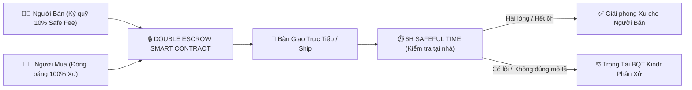

# 🧸 Kindr — Nền Tảng Trao Đổi Đồ Trẻ Em Siêu Cục Bộ & Bảo Chứng Kép (Double Escrow)

<div align="center">
  <p><b>Giải pháp trao đổi đồ dùng, đồ chơi, quần áo trẻ em văn minh, tiết kiệm và an toàn tuyệt đối cho cộng đồng mẹ bỉm sữa.</b></p>
  
  <p>
    
    
    
    
    
    
    
  </p>
</div>

---

## 🌟 1. Giới Thiệu & Bối Cảnh (Context & Vision)

Trẻ em lớn rất nhanh — quần áo, xe đẩy, nôi cũi, đồ chơi trí tuệ thường chỉ được dùng trong vài tháng rồi bị xếp xó, gây lãng phí hàng triệu đồng cho mỗi gia đình và tạo gánh nặng rác thải ra môi trường.

Tuy nhiên, việc mua bán sang tay truyền thống trên các hội nhóm Facebook/Zalo tiềm ẩn vô số rủi ro:
- **Lừa đảo chuyển cọc trước.**
- **Đồ nhận về rách, bẩn, hỏng, không giống ảnh đăng.**
- **Người mua bùng hàng hoặc người bán vô trách nhiệm sau khi nhận tiền.**

**Kindr ra đời để giải quyết triệt để bài toán này** thông qua mô hình **Trao đổi siêu cục bộ** kết hợp **Cơ chế Ký Quỹ Kép (Double Escrow)** và **6 Giờ Kiểm Định Tại Nhà (Safeful Time)**.

---

## 🛡️ 2. Các Tính Năng Đột Phá (Core Innovations)



### 1. ⚖️ Cơ Chế Bảo Chứng Kép (Double Escrow)
* **Người Bán:** Khi đăng đồ phải tạm khóa **10% Safe Fee** từ ví Xu để cam kết tính trung thực của món đồ (Hàng like-new, sạch sẽ, hoạt động tốt).
* **Người Mua:** Khi bấm đổi đồ, hệ thống tạm đóng băng **100% giá trị Xu** trong khay ký quỹ.

### 2. ⏱️ 6 Giờ Kiểm Định Tại Nhà (6-Hour Safeful Time)
* Sau khi hai bên gặp nhau bàn giao đồ, đồng hồ đếm ngược **6 tiếng** sẽ kích hoạt.
* Người mua có đủ thời gian mang đồ về nhà cho bé dùng thử, tiệt trùng, kiểm tra pin/động cơ.
* **Auto-Finalizer:** Sau 6 tiếng nếu không có khiếu nại, Worker tự động giải phóng Xu + hoàn trả Safe Fee cho người bán.

### 3. 🪙 Tokenomics & Điểm "Mẹ Bỉm Văn Minh"
* **Ví Xu Kindr:** 1 Xu = 10.000 VNĐ. Nạp Xu linh hoạt qua mã VietQR động.
* **Welcome Credit:** Tặng 10 Xu khi đăng ký tài khoản mới để trải nghiệm đổi đồ ngay (Khóa rút tiền mặt đối với Xu quà tặng theo kinh tế hành vi).
* **Thang Điểm Văn Minh (0 - 100đ):** Giao dịch đúng hẹn, đồ chất lượng $\rightarrow$ Tăng điểm; Bị khiếu nại hoặc hủy kèo $\rightarrow$ Trừ điểm và khóa tài khoản khi tái phạm.

### 4. 👶 Sổ Tay Mẹ Bỉm (WHO & Tiêm Chủng)
* Lịch tiêm chủng chuẩn Bộ Y Tế theo từng tháng tuổi của bé kèm thông tin vắc-xin chi tiết.
* Biểu đồ chiều cao & cân nặng chuẩn WHO giúp mẹ theo dõi đà phát triển của con.

### 5. 🎁 Trạm Tặng Đồ (0 Xu)
* Danh mục phi lợi nhuận dành riêng cho các mẹ muốn san sẻ quần áo, đồ chơi cũ 0 Xu cho các gia đình khó khăn.

### 6. 🛡️ Bảng Quản Trị Admin Độc Lập
* Hệ thống 7 màn hình Backoffice: Dashboard thống kê, Quản lý tài khoản (Khóa/Mở User), Kiểm duyệt bài đăng, Phân xử khiếu nại (Hoàn Xu / Trừ điểm), Duyệt lệnh rút tiền, Xử lý Báo cáo vi phạm.

---

## 🏗️ 3. Kiến Trúc Dự Án (Monorepo Architecture)

Dự án được cấu trúc theo mô hình **Fullstack Monorepo** chuẩn mực:

```text
Kindr/
├── client/                     # 📱 React Native (Expo SDK 56 + React 19)
│   ├── src/
│   │   ├── app/                # Redux Store & Navigation (AppNavigator)
│   │   ├── components/         # Common UI (Button, ScalePressable, PulseBadge, FadeInItem...)
│   │   ├── features/           # Feature Modules (home, exchange, care-handbook, chat, admin...)
│   │   ├── services/           # Axios HTTP Client & Socket.IO Realtime Client
│   │   └── theme/              # Design System Tokens (DESIGN.md)
│   └── package.json
│
├── server/                     # 🚀 Node.js + Express + MongoDB + Socket.IO
│   ├── src/
│   │   ├── config/             # DB & Environment Configuration
│   │   ├── middleware/         # requireAuth, requireAdmin, validateObjectId
│   │   ├── models/             # Mongoose Schemas (User, Product, Transaction, Chat...)
│   │   ├── routes/             # REST API Endpoints (/auth, /products, /transactions, /admin...)
│   │   ├── services/           # Escrow Service & Cron Job 6h Auto-Finalizer
│   │   ├── socket/             # Realtime Socket.IO Handlers (P2P Chat & Push Notifications)
│   │   └── seed/               # Database Seeder Data
│   └── package.json
│
├── docs/                       # 📚 Tài liệu đặc tả kỹ thuật & Wireframes
├── package.json                # Root Concurrently Orchestrator
└── README.md
```

---

## 🚀 4. Hướng Dẫn Cài Đặt & Chạy Ứng Dụng (Getting Started)

### Yêu cầu hệ thống:
* **Node.js:** `v18+` hoặc `v20+`
* **MongoDB:** Đang chạy tại `localhost:27017` (hoặc cấu hình URI trong `server/.env`)

### 1. Cài đặt Dependencies:
Tại thư mục gốc `Kindr/`:
```bash
npm install
npm --prefix client install
npm --prefix server install
```

### 2. Nạp Dữ Liệu Mẫu (Seeder):
```bash
npm run server:seed
```

### 3. Khởi Động Dự Án (Chỉ 1 câu lệnh duy nhất):
```bash
npm run dev
```
> Lệnh trên sẽ tự động kích hoạt song song **Backend Server** tại `http://localhost:5000` và **Expo Metro Bundler** tại `http://localhost:8081`.

---

## 🔑 5. Danh Sách Tài Khoản Thử Nghiệm (Demo Accounts)

Tất cả các tài khoản mặc định đều có mật khẩu là: **`123456`**

| Vai trò | Tên hiển thị | Số điện thoại đăng nhập | Mật khẩu | Đặc điểm tài khoản |
|:---|:---|:---:|:---:|:---|
| 👩‍🦰 **User (Người bán)** | Mẹ Hoa Lan | `0905123456` | `123456` | 35 Xu, 98đ Văn Minh, Đăng sẵn đồ chơi like-new |
| 👩‍🦱 **User (Người mua)** | Mẹ Bắp | `0905234567` | `123456` | 25 Xu, 95đ Văn Minh |
| 👩 **User** | Mẹ Ngọc Ánh | `0905345678` | `123456` | 50 Xu, 100đ Văn Minh |
| 🛡️ **Admin BQT** | Ban Quản Trị Kindr | `0900000000` | `123456` | Toàn quyền truy cập Bảng Quản Trị Admin |

> 💡 **Tự tạo tài khoản:** Bấm **"Đăng ký ngay"** trên màn hình Login $\rightarrow$ Hệ thống sẽ lưu vào MongoDB thật và tặng ngay **10 Xu Welcome Credit** vào ví!

---

## 🧪 6. Kiểm Thử Tự Động (Automated Testing)

Kindr tích hợp bộ Integration Tests toàn diện sử dụng **Jest + Supertest**:

```bash
# Chạy bộ test suite (Auth, Products, Double Escrow, Wallet)
npm run test

# Kiểm tra toàn vẹn TypeScript (Strict Typecheck - 0 errors)
npm run typecheck
```

---

## 📄 7. Bản Quyền & Giấy Phép (License)

Dự án được phân phối dưới giấy phép **MIT License** — Xem file [LICENSE](LICENSE) để biết thêm chi tiết.

<div align="center">
  <p><b>Kindr — Vì một tuổi thơ sẻ chia, văn minh và bền vững 🌱</b></p>
</div>
